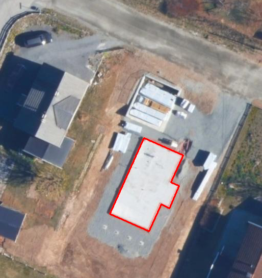
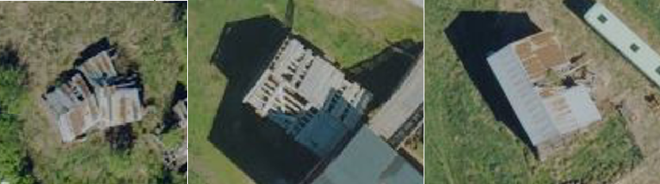
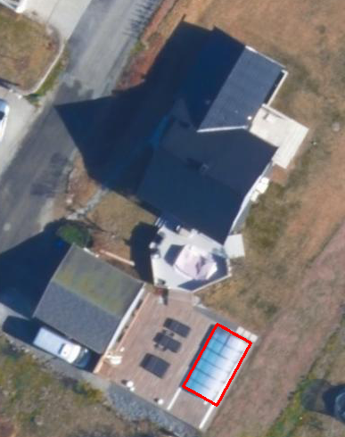
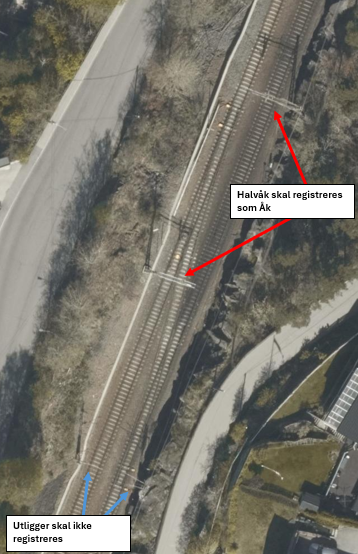
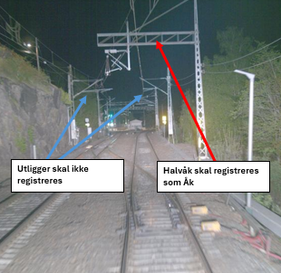
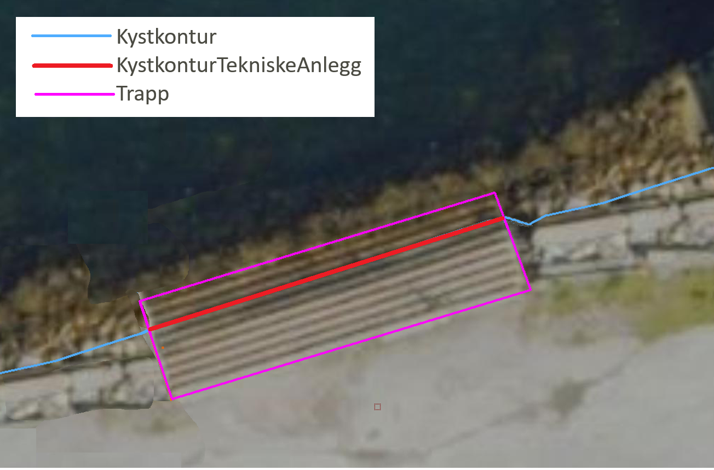
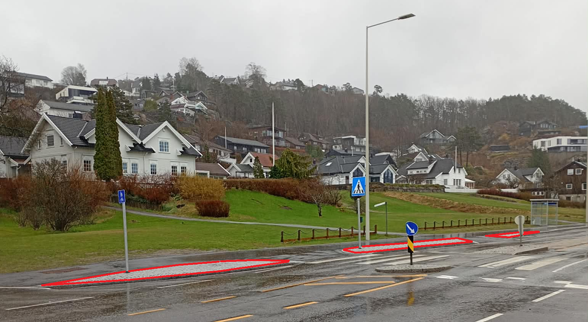

= Vedlegg til FKB Fotogrammetriske registreringsinstrukser - versjon 2026-01-01
:sectnums:
:toc: left
:toc-title: Innholdsfortegnelse
:toclevels: 3
:figure-caption: Figur
:table-caption: Tabell
:section-refsig: kapittel
:doctype: article
:encoding: utf-8
:lang: nb
:URLrot: https://sosi.geonorge.no/registreringsinstrukser
:fkb: https://sosi.geonorge.no/Standarder/FKB_generell_del
:publisert: Oppdatert 2026-05-01

CAUTION: {publisert} 

== Vedlegg til FKB Fotogrammetriske registreringsinstrukser - versjon 2026-01-01

=== Innledning

==== Om ulike versjoner av FKB Generell del, FKB-produktspesifikasjoner og Fotogrammetriske registreringsinstrukser
Det er siste versjon av fotogrammetriske registreringsinstrukser som er grunnlaget for inngåtte avtaler i kartleggingsprosjektene for 2026. 
Følg linkene videre fra https://www.kartverket.no/geodataarbeid/geovekst/fkb-produktspesifikasjoner[tabell over FKB produktspesifikasjoner og fotogrammetriske registreringsinstrukser på kartverket.no].

FKB Generell del ble oppgradert til versjon 5.1 i løpet av 2024 (med referansedato 2024-07-01). 
I FKB Generell del 5.1 er det innført et nytt https://sosi.geonorge.no/Standarder/FKB_generell_del/#_generelle_retningslinjer_for_fotogrammetrisk_registrering_av_fkb_normativt[vedlegg D] som beskriver generelle retningslinjer for fotogrammetrisk registering av FKB. 

Fotogrammetriske registreringsinstrukser som er oppdatert til versjon 5.1 er for datasettene FKB-Bygning, FKB-BygnAnlegg, FKB-Ledning, FKB-Veg og FKB-Vann. Disse henviser til FKB Generell del 5.1 og vedlegg D. 
For fotogrammetriske registreringsinstrukser som ikke ble revidert 2025-01-01 er det henvist til eldre versjoner av FKB Generell del og de generelle retningslinjene for fotogrammetrisk registrering er der angitt i kapittel 2 i den enkelte registreringsinstruks. 

==== Formål med dokumentet

Erfaringene fra prosjektene i 2025-sesongen tilsier at det er behov for å presisere tolkning/håndtering av FKB 5.0/5.1 registreringsinstruksene på en del områder. Dette dokumentet samler disse presiseringene for hvert datasett og bør derfor leses sammen med de fotogrammetriske registreringsinstruksene ved gjennomføring av FKB kartleggingsprosjekter 2026.

Det presiseres at dette dokumentet kun har som formål å klargjøre/presisere innholdet i FKB registreringsinstruksene og ikke _endre_ innholdet i disse dokumentene på noen måte.

Det vil være naturlig at justeringene/presiseringene som er beskrevet i dette dokumenten innarbeides i reviderte FKB registreringsinstrukser som vil bli benyttet i neste kartleggingssesong.

==== Linker

* FKB 5.1 generell del: {fkb}
* Geovekst produktspesifikasjoner og registreringsinstrukser: https://kartverket.no/geodataarbeid/geovekst/fkb-produktspesifikasjoner

=== Endringslogg

Tabellen under viser en oversikt over når vedlegget har blitt endret. 

:xrefstyle: short

[cols="1,4"]
|===
|Dato|Endringer

| 2026-05-01
| Første versjon av vedlegg 2026

|===

[[fkbreginstruks]]
== FKB Fotogrammetriske registreringsinstrukser

:ds: FKB-Bygning
:spek: {URLrot}/{ds}/5.1/Fotogrammetrisk_2026-01-01/.
[[FKBBygning]]
=== {ds}

Fotogrammetrisk registreringsinstruks for {ds} 5.1 er tilgjengelig på {spek}

==== Presisering for objekttypen Grunnmur
I kapittel 3.5 Grunnmur, Tilleggsinformasjon for fotogrammetrisk registrering er det lagt til et nytt bilde som beskriver Grunnmur i form av en bunnplate av betong. 

.Grunnmursplate av betong - skal registreres som Grunnmur

:ds: FKB-BygnAnlegg
:spek: {URLrot}/{ds}/5.1/Fotogrammetrisk_2026-01-01/.
[[FKBBygnAnlegg]]
=== {ds}

Fotogrammetrisk registreringsinstruks for {ds} 5.1 er tilgjengelig på {spek}

==== Presisering for objekttypen Ruin.
I kapittel 3.18 Ruin, Tilleggsinformasjon for fotogrammetrisk registrering presiseres det at dersom en bygning fortsatt har mer eller mindre intakte takflater, slik at hjørnene på disse kan registreres, skal bygningen registreres som Bygning eller AnnenBygning i FKB-Bygning, og ikke som Ruin. Det er lagt til en figur som viser eksempler på bygninger som ikke er ruiner.

.Eksempel på bygninger som skal registreres som Bygning/AnnenBygning og ikke som Ruin

==== Presisering for objekttypen Stikkrenne.
I kapittel 4.2 Kvalitetsklasser, har objekttypen Stikkrenne skiftet kvalitetssklasse fra 3 til 4 i både grunnriss og høyde.

==== Presisering for objekttypen Svømmebasseng.
I kapittel 3.26 Svømmebasseng, Tilleggsinformasjon for fotogrammetrisk registrering er det lagt til en ny figur som beskriver registrering av Svømmebasseng med tak over.

.Svømmebasseng med tak over

:ds: FKB-Ledning
:spek: {URLrot}/{ds}/5.1/Fotogrammetrisk_2026-01-01/.
[[FKBLedning]]
=== {ds}

Fotogrammetrisk registreringsinstruks for {ds} 5.1 er tilgjengelig på {spek}

==== Presisering for objekttypen Trase.
I kapittel 3.12 Trase, Tilleggsinformasjon for fotogrammetrisk registrering er det endret på en setning. Ny tekst er _Øvrige lavspent- og ekom-traseer skal ikke registreres fotogrammetrisk med mindre dette avtales særskilt (er opsjonelt)._

==== Presisering for objekttypen Åk.
I kapittel 3.15 Åk, Tilleggsinformasjon for fotogrammetrisk registrering er det lagt til to nye figurer som skal beskrive registrering av halvåk.

.Halvåk sett fra luften

.Halvåk sett fra bakken

:ds: FKB-TraktorvegSti
:spek: {URLrot}/{ds}/5.0/Fotogrammetrisk_2024-01-01/.
[[FKBTraktorvegSti]]
=== {ds}

Fotogrammetrisk registreringsinstruks for {ds} 5.0 er tilgjengelig på {spek}

==== Presisering om henvisninger til Elveg
Det presiseres at alle henvisninger til Elveg/Elveg 2.0 skal erstattes med henvisninger til NVDB Vegnett Pluss.

Tilsvarende skal alle henvisninger til _typeveg_ i Elveg endres til nye typevegkoder i NVDB Vegnett Pluss. I teksten til figur 2, 3 og 12 skal _enkelBilveg_ endres til _bilveg_, i teksten til figur 7, 8, 9 og 10 skal _enkel_ endres til _bilveg_ og i teksten til figur 3 skal _gangOgSykkelveg_ endres til _gsv_.

==== Presisering for typeveg sti
I kapittel 3.1 Objekttype: Veglenke, Presiseringer til beskrivelsen av kodelistekoder, Typeveg - Kodenavn: Sti, Tilleggsopplysninger FKB presiseres det at sti over jernbane ikke skal registreres ved ubevoktede overganger. Bane NOR leverer manus over bevoktede overganger, og det er kun der det foreligger manus at stier skal krysse jernbanelinja.

:ds: FKB-Vann
:spek: {URLrot}/{ds}/5.1/Fotogrammetrisk_2026-01-01/.
[[FKBVann]]
=== {ds}

Fotogrammetrisk registreringsinstruks for {ds} 5.1 er tilgjengelig på {spek}

==== Presisering for objekttypen KystkonturTekniskeAnlegg
I kapittel 3.2 Objekttype: KystkonturTekniskeAnlegg, Tilleggsinformasjon for fotogrammetrisk registrering presiseres det at KystkonturTekniskeAnlegg også skal brukes ved trapper som går ned i vann. Disse registreres med _kystkonstruksjontype 11_ (trapper). Det er lagt til en figur som viser eksempel på registrering.

.Eksempel på registrering av KystkonturTekniskeAnlegg ved trapp som går ned i vannet.

:ds: FKB-Veg
:spek: {URLrot}/{ds}/5.1/Fotogrammetrisk_2026-01-01/.
[[FKBVeg]]
=== {ds}

Fotogrammetrisk registreringsinstruks for {ds} 5.1 er tilgjengelig på {spek}

==== Presisering om henvisninger til Elveg
Det presiseres at alle henvisninger til Elveg/Elveg 2.0 skal erstattes med henvisninger til NVDB Vegnett Pluss.

====  Presisering for objekttypen Trafikkøy
I kapittel 3.2. Objekttype: Trafikkøy, Tilleggsinformasjon for fotogrammetrisk registrering presiseres det at kun objekter som er øy i objekttypen VegKjørende skal registreres. Arealer som grenser til VegGåendeOgSyklende eller områder som ikke er flatedannet i FKB-Veg, skal ikke registreres som Trafikkøy. Det er lagt til en figur som viser eksempel på areal som ikke skal registreres som Trafikkøy.

.Eksempel på arealer som ikke skal registreres som Trafikkøy.

====  Presisering for objekttypen VegGåendeOgSyklende
I kapittel 3.3 Objekttype: VegGåendeOgSyklende presiseres det at egenskapen _typeveg_ skal samsvare med kodeliste for _typeveg_ i NVDB Vegnett Pluss. For VegGåendeOgSyklende betyr dette at _typeveg gangSykkel_ er endret til _gsv_ og _typeveg sykkel_ er endret til _sv_, samt at _sfelt_ (sykkelfelt) er lagt til kodelisten. 

====  Presisering for objekttypen VegKjørende
I kapittel 3.4 Objekttype: VegKjørende presiseres det at egenskapen _typeveg_ skal samsvare med kodeliste for _typeveg_ i NVDB Vegnett Pluss. For VegKjørende betyr dette at _typeveg enkel_ er endret til _bilveg_, _typeveg kanalisert_ er endret til _kanalveg_ og _typeveg rundkjoring_ er endret til _rkj_. 

:ds: NVDB Vegnett Pluss
:spek: {URLrot}/NVDB_Vegnett_Pluss/1.1/Fotogrammetrisk_2026-01-01/.
[[Elveg]]
=== {ds}

Fotogrammetrisk registreringsinstruks for {ds} 1.1 er tilgjengelig på {spek}

==== Presisering om geometriforbedring av konnekteringslenker

I kapittel 3. Objekttyper og egenskaper, Konnekteringslenke erstattes avsnittet "Eksisterende konnekteringslenker skal som hovedregel ikke endres (selv om tilstøtende veglenker endres/slettes). Avvik fra dette må ev. avtales spesielt."

Ny tekst er "Eksisterende konnekteringslenker skal som hovedregel ikke endres. Avvik fra dette må ev. avtales spesielt. Eksisterende konnekteringslenker skal slettes dersom veglenka den skaper forbindelse til slettes. Eksisterende konnekteringslenker skal geometriforbedres dersom tilstøtende veglenker geometriforbedres. Ved geometriforbedring skal egenskapen _konnekteringslenke Ja_ overføres til ny geometri."
 
====  Presisering om synbarhetskoding
I kapittel 5.1 Registrering av nye veglenker er det i avsnittet om oppsplitting av veglenker i forbindelse med synbarhetskoding lagt til en presisering av hvordan veglenker med vekslende synbarhet skal registreres. 

Avsnittet er nå som følger: "Så langt det er mulig bør det unngås å ha altfor mange korte og oppstykkede veglenker i forbindelse med synbarhetskoding. Ved vekslende synbarhet, der enkeltstykkene med lik synbarhet er under 20 meter, skal veglenka ikke splittes opp, og synbarheten settes til den dominerende synbarheten til veglenka. Les mer om Synbarhet i kap.4.2." 

 